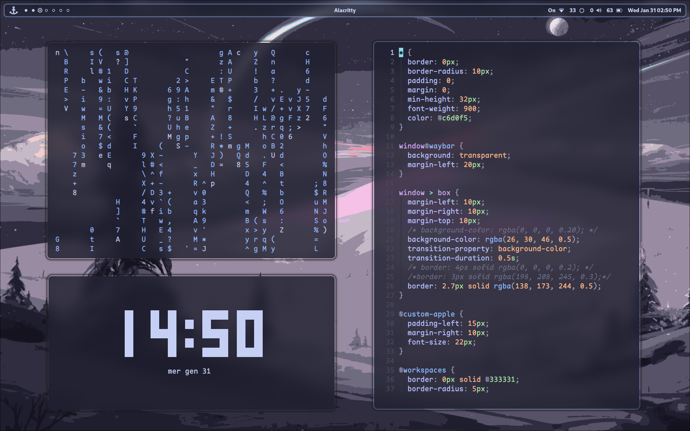
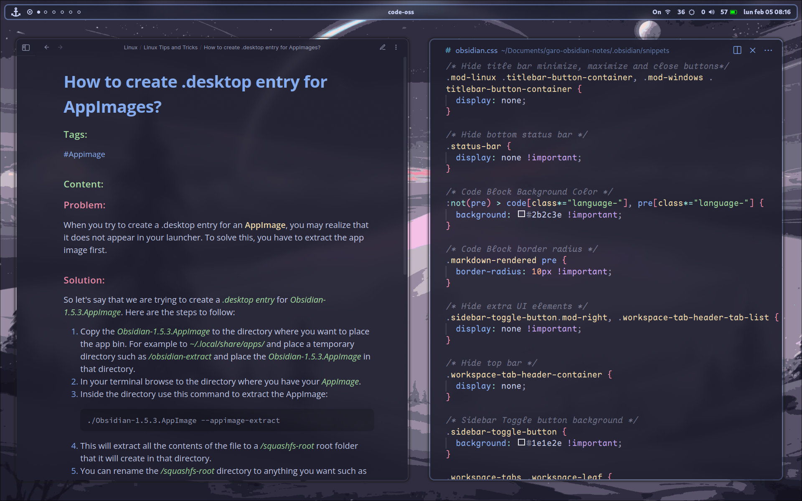
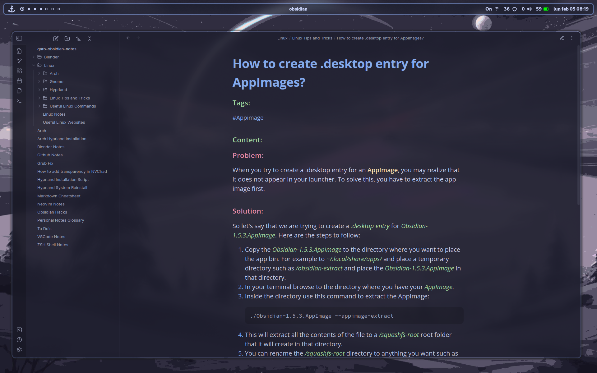
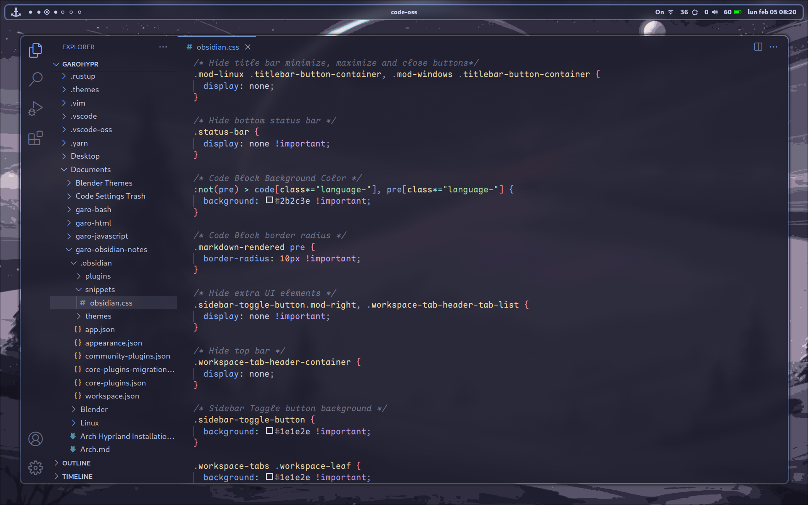
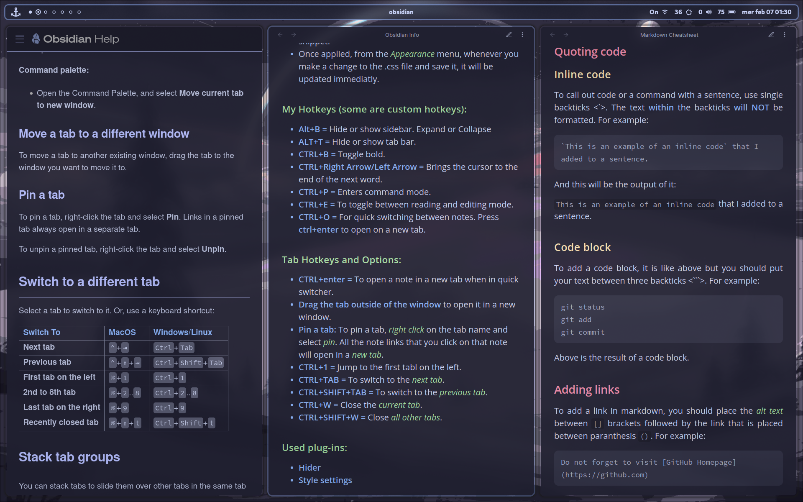
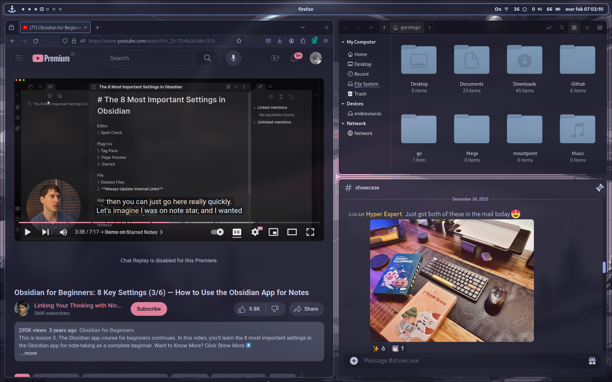
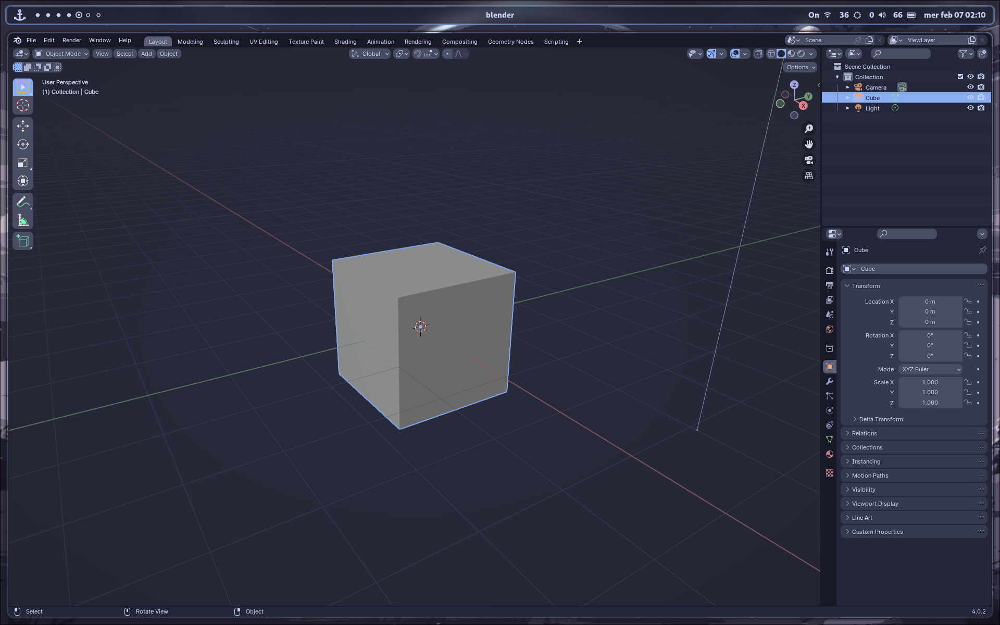

# Hyprland Dot Files

This is still a work in progress.. Try it on your own risk.

#### The system:
- **OS:** EndeavourOS
- **WM:** Hyprland

#### The apps that I use:
- **Alacritty** as terminal.
- **Kitty** as terminal alternative.
- **Neovim** - I set it up with Youtube tutorials.
- **VSCode** - can be seen in the screenshots.
- **Obsidian** - can be seen in the screenshots.
- **Waybar** for top bar.
- **Wofi** for app-launcher.
- **Nemo** for file manager.
- **Discord** is used with BetterDiscord for theme and plug-in support.
- **Stylus plug-in** for Firefox for custom .css themes for web sites.
- **Swayidle** to dim the screen and turn off the screen.
- **Swww** to cycle between the wallpapers every 10 minutes.
- **Grim** and **slurp** for screenshot.

#### Things to do:
- [ ] Understand how to export Firefox settings.
- [ ] Write the neccessary dependencies - I am a Linux noob, don't know if I will write a correct one.
- [ ] Clean the dotfiles to make them more organized
- [ ] Learn to export the oh my bash settings as well

#### ~/.g-scripts Folder:
It includes some of the bash scripts that I wrote and use. But as you can tell from the scripts, I am a beginner, so I am still learning and they most probably are not efficient. But well.. I am learning and having fun. :)

#### My Extra Hotkeys:
##### Borders:
- SUPER + B = Removes the borders
- SUPER + CTRL + B = Sets the border size to 1px (default is 3px)
- SUPER + SHIFT + B = Sets the border size to 2px (default is 3px)

##### Waybar:
- SUPER + W = Toggles Waybar - Hide and Show.
- SUPER + SHIFT + W = Reloads my **default** Waybar config. **Transparent** background, **non-floating**. 
- SUPER + CTRL + W = **Floating** Waybar, with solid background colour.
- SUPER + ALT + W = **Floating** Waybar, with **border** and **semi-transparent** background.

##### Gaps:
- SUPER + - = Smaller gaps
- SUPER + = = For biger gaps
- SUPER + SHIFT + = No gaps
- SUPER + R = Reset gaps

##### App Launcher:
- SUPER + D = Wofi

##### Terminal:
- SUPER + RETURN = Alacritty
- SUPER + SHIFT + RETURN = Floating blue Alacritty
- SUPER + K = Kitty

##### Full-screen:
- SUPER + F = Toggle full-screen for the focused app

##### File-manager:
- SUPER + N = Nemo

##### Window management:
- SUPER + J = Toggle Split direction: Vertical/Horizontal
- SUPER + Arrow keys = Move **focus**
- SUPER + CTRL + Arrow Keys = **Move** active window
- SUPER + SHIFT + Arrow Keys = **Resize** active window

##### Screenshot region:
- SUPER + SHIFT + P = Screenshot the selected region *(needs **grim** and **slurp**)*

#### Some screenshots:

If you use these dot-files, I hope that you enjoy using it as much as I do! :)
